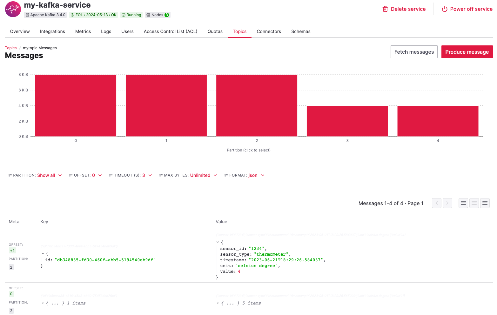
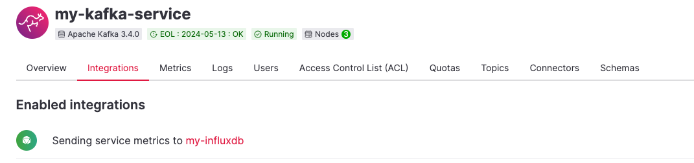
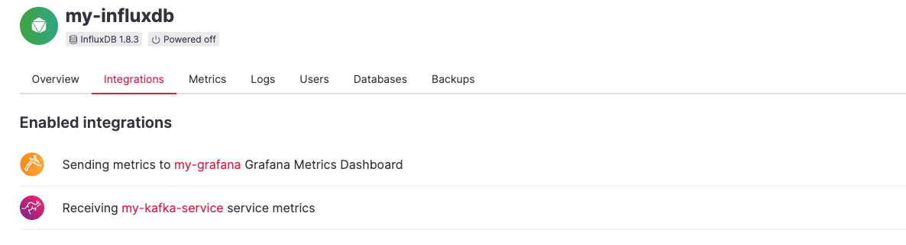
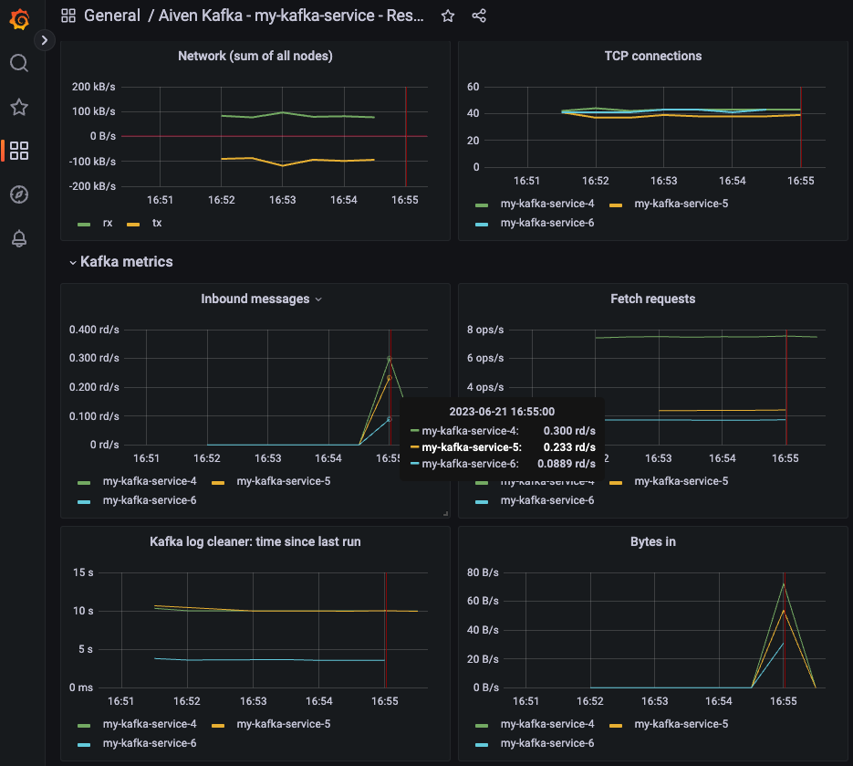

Kafka is a powerful tool that is very helpful when talking about event management, microservices, asynchronous patterns etc... But it could also be a nightmare when it comes to managing and operating it by yourself.

**Purpose is of this article is to show how easy it is to set up a Kafka managed service, and its observability layer, both operated by Aiven, while you and your developers focus on code and what's really matters to you.**

## Prerequisites:
To go through this tutorial, you will need an account to sign in on Aiven’s console (https://console.aiven.io/). You can create it for free if you don’t have it yet, and get free credits for trial when creating your account.

## Caveats
This walkthrough is intended to demonstrate how easy and fast it is to deplay and observe a managed Kafka service. Additional steps would be needed for production grade, which would mainly consist of enabling additional built-in security features, such as account management, IP whitelisting, etc…

## Fast Track
If you don't want to read all this article, a terraform file is provided in the repo for a "fast track" setup, putting everything in place at once. All you will need additionnaly is an API token that you can create in your "account" section.
For the others, let's create the environment step by step through the UI:

## Create your managed kafka service:
Once connected on Aiven console, click the "create service" red button, upper left, and choose Apache Kafka.
Customize the service according to your context if you want, even if default values are suitable for this test use case.
Your service summary should look like this:

Hit the "create service" button on the right, build has started!
On the "Configure your client" page, select your client language. We’ll use Python for this example.
Follow the instructions to install Kafka-python library, and note the Service URI and download the 3 certificates that will be required to connect at a later stage: ca.pem, service.cert, and service.key

Click the "Next: Create Topic" button and create a topic with the name of your choice, "mytopic" for example

The next pages give you some insights on how to consume/produce your first messages, and enable integrations for additional capabilities, what we will do later in this article. You can now "Finish setup", your kafka service will be up and ready to use within a few minutes.

## Configure a python client and push some messages in Kafka  
Everything is now place to push messages from our computer
We will use KafkaProducer lib to push messages in our demo topic. We will first instantiate our producer with the info retrieved earlier at service creation: service URI, and path to *ca.pem*, *service.cert* and *service.key* files.

	producer = KafkaProducer(
		bootstrap_servers=service_uri,
		security_protocol="SSL",
		ssl_cafile=ca_path,
		ssl_certfile=cert_path,
		ssl_keyfile=key_path,
	)

We can now generate random messages coming from a fake IoT sensor:

	for i in range(1, 5):
		message = {
			"sensor_type" : "thermometer",
			"sensor_id": "1234",
			"unit": "celsius degree",
			"value" : i,
			"timestamp": str(datetime.now().isoformat())
		}

We then rely on our producer to send each of the messages to Kafka, with a unique identifier as Key:

		producer.send("mytopic",
			json.dumps(message).encode("utf-8"),
			json.dumps({'id': str(uuid.uuid4())}).encode('utf-8')
		)
	# Wait for all messages to be sent
	producer.flush()
  
That’s it! Our first messages are now in the pipe!

## Review our messages in Kafka, from the UI
We could develop a similar ‘consumer’ python app to retreive our messages, or we can more easily see them in Aiven’s UI: connected to the console, click on your Kafka service, go to the "Topics" tab, select the demo topic, and click on "messages". Hitting the "Fetch messages" button will show the messages that are currently in the topic (filter on json Format for better readability). This page also gives some information about the topic shape: number of partitions and their usage.

## Enable observability on your Kafka service
Now the service is running and messages are going through it, let's enable observability capabilities.

In the console, click on your Kafka service, go to the "Integrations" tab, and select the "Store Metrics" Aiven native integration. Select "New service" and choose "New InfluxDB service" type. Click continue. Keep defalut values, and click "create and enable".

You can now see that metrics are now gathered by this InfluxDB service:

Click on this inlfuxDB service, go to the integrations tab, and now select the "Grafana Metrics Dashboard" solution. In the same way, create a new Grafana service type, with default values.

We can now see that our influxDB service is receiving metrics from our Kafka service, and pushing them into a Grafana Dashboard.

By clicking on this Grafana service, you will retreive the grafana URI and credentials that give you access to default Grafana dashboard. It can now be customized to fit your needs!

